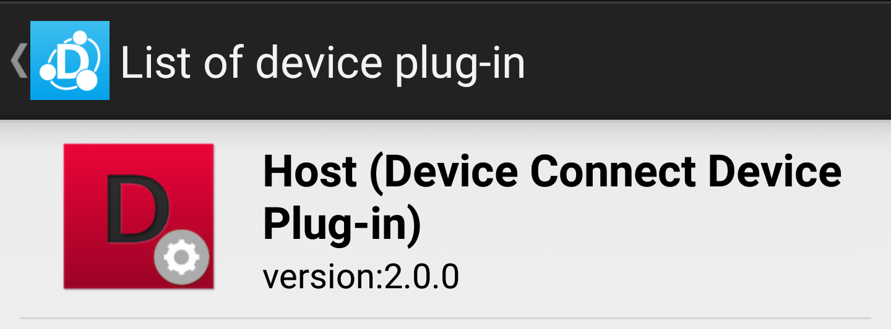

# Androidの使い方

Android端末にはDeviceConnect Managerアプリをインストールしますが、さらにHostプラグインをインストールすることでAndroidデバイス自体の機能やデータをDeviceConnectを通して操作できるようになります。

## セットアップ

DeviceConnect Managerをインストールした後、Hostプラグインをビルド&インストールするか、[ビルド済みのapkファイルをダウンロード&インストール](https://github.com/DeviceConnectUsers/deviceconnectusers.github.io/releases/download/0.1/dConnectDeviceHost.apk)します。

これで使用準備が整いました。

## 利用上の注意

デバイスがはじめてカメラにアクセスする際には許可を求めるダイアログがデバイス側に表示されます。同様に、ストレージにアクセスする場合や、設定への書き込みを行う場合もアラートが出ます。

## Hostプラグインがサポートしている機能

Hostプラグインがサポートしている機能は次の通りです。これは対象のAndroidデバイスによって変わるかも知れません。

- [バッテリー](/webapi/battery)
- [バイブレーションAPI](/webapi/vibration/)
- [メディアストリーミング録画API](/webapi/mediastream_recording)
- [ファイル参照API](/webapi/file_descriptor)
- settings
- [Canvas](/webapi/canvas)
- phone
- keyevent
- connect
- [通知](/webapi/notification)
- touch
- file
- proximity
- deviceorientation
- media_player
